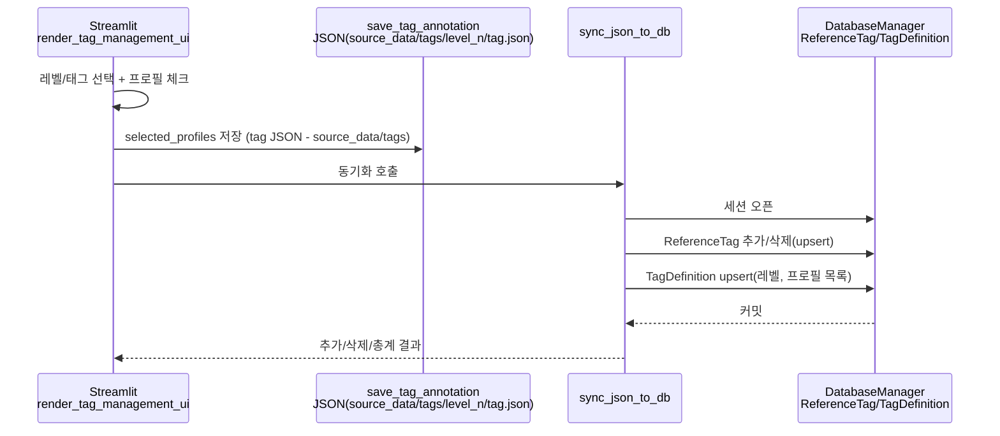
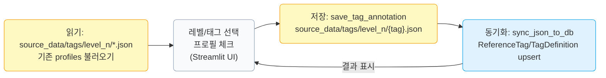

# utils 폴더 개요

백엔드/DB와 연계하거나 Streamlit UI에서 재사용되는 분석·태그·프로파일 관리 유틸 모듈 모음입니다. 각 파일/주요 함수의 역할을 간단히 정리합니다.

## 모듈별 설명 + 주요 함수
- `tag_manager.py` (태그 UI/DB 동기화)
  - `render_tag_management_ui`: Streamlit에서 레벨/태그 선택 후 프로필 체크, JSON 저장·DB 동기화 트리거.
  - `save_tag_annotation`/`load_tag_annotation`: level_n 디렉토리에 태그별 JSON 저장/로드.
  - `sync_json_to_db`: `ReferenceTag`/`TagDefinition`을 JSON 기준으로 upsert.
  - `get_db_level`/`get_fs_level`: `tag_classification.json` 레벨을 사용해 DB/파일 레벨 매핑.
- `tag_processor.py` (태그 정의/분석)
  - `get_tag_groups`: `tag_classification.json`을 로드해 레벨별 태그 리스트 반환.
  - `analyze_tag_relationships`: 레벨 3→2, 2→1, 3→1 동시 빈도 집계.
  - `sort_by_frequency`: 관계 빈도를 기반으로 태그를 정렬.
- `profile_manager.py` (프로필/태그 CRUD 보조)
  - ReferenceProfile/ReferenceTag 연동, 이미지·프로필 매핑 유틸.
- `landmark_calculator.py` (랜드마크 측정)
  - `calculate_length`, `calculate_curvature`: 길이·곡률·각도 계산.
- `data_analyzer.py` (EDA 유틸)
  - 집계/필터/변환 함수 집합.
- `statistical_analyzer.py` (통계/ML 보조)
  - 분포·상관·ML 피처 엔지니어링 헬퍼.
- `korean_name_parser.py` (이름 처리)
  - 한글 이름 분리/로마자 변환 보조.
- `user_analyzer.py` (사용자 분석)
  - 랜드마크 기반 태그/특징 추출 파이프라인 헬퍼.
- `visualization.py` (시각화)
  - Plotly/Matplotlib 그래프·이미지 시각화 편의 함수.

## 태그 → DB 동기화 흐름 (Streamlit)
- 태그 정의: `tag_processor.get_tag_groups()`에서 추상/1차/2차 태그 목록을 제공하고, `tag_manager._classify_tag_group`/`get_db_level`이 이를 기반으로 레벨(추상=3, 1차=2, 2차=1)을 결정.
- UI 선택: `tag_manager.render_tag_management_ui()`에서 레벨/태그를 고르고 프로필 썸네일을 체크박스로 선택.
- JSON 저장: `save_tag_annotation`이 선택 프로필 목록을 `/back_analysis/src/database/definitions/tags/level_{n}/...json`으로 기록.
- DB 반영: `sync_json_to_db`가 JSON을 읽어 `DatabaseManager` 세션으로 `ReferenceTag`를 프로필별 추가/삭제하고, `TagDefinition`을 upsert하여 레벨/프로필 목록을 저장. Streamlit에서 백엔드 API 없이 직접 DB 세션을 열어 반영하는 구조.

## Tag Manager 동작 다이어그램 (JSON → DB 동기화)

## Streamlit UI 연결 포인트 (태그 관련)
- App Advanced > **통계적 연관성 분석**: `app_advanced.py`의 `render_statistical_correlation_tab()` 내부 `render_independent_variables_ui()`(독립변수 드롭박스)와 `render_target_variable_ui()`(종속 변수 태그 드롭박스)에서 랜드마크/태그 데이터를 선택해 통계 분석에 사용.
- App Advanced > **태그 관계도**: `render_sankey_diagram_tab()`이 `analyze_tag_relationships()`로 관계 집계를 만든 뒤, “표시할 관계”·“추상 태그 필터” 등의 설정 UI를 제공하고 `create_sankey_diagram()`(utils/visualization.py)을 호출해 Sankey 다이어그램을 렌더링.
- Tag Manager 페이지: `utils/tag_manager.render_tag_management_ui()`에서 레벨(1/2/3차) 선택 → `tag_processor.get_tag_groups()`로 필터된 태그 드롭박스 제공 → 프로필 체크박스로 선택 후 JSON/DB 동기화(`save_tag_annotation` → `sync_json_to_db`).

## 의존성/주의
- 일부 모듈(`tag_manager`, `profile_manager`)은 `back_analysis`의 DB 연결/Reference 모델에 접근하므로 PYTHONPATH에 `back_analysis/src`가 필요합니다.
- 태그 그룹은 현재 하드코딩된 `tag_processor.get_tag_groups()`를 기준으로 합니다. `tag_classification.json`을 사용하려면 해당 로더를 추가하거나 태그 정의를 업데이트해야 합니다.
